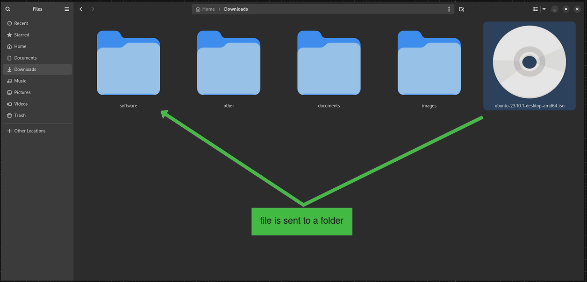

# Download-watcher

## Description

Consider your downloads folder, each time a new file is downloaded there, the file is moved to a subfolder, according to its extension. This mapping can be customized to match your needs, as a JSON file.

[json-ext-map.json](json-ext-map.json)

Other file extensions will be saved to a folder named "other".

## Screenshots

## Usage

    ./download-watcher <folder_to_watch> <json_ext_map_file> &